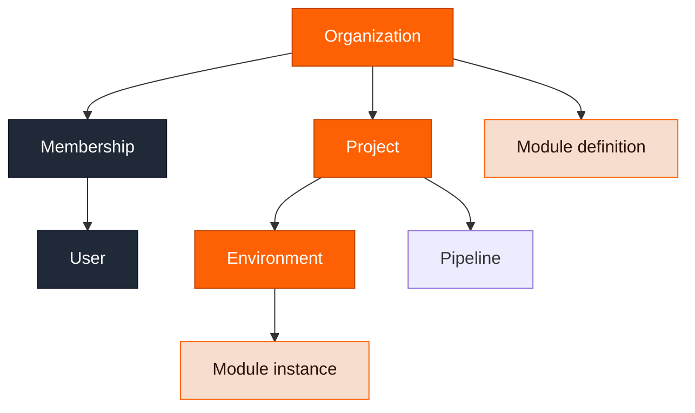

Your Ravion organization is the root container for users and projects. Enterprise companies can have multiple Ravion organizations with unified billing.

Projects and environments are lightweight containers for all your infrastructure and pipelines.

