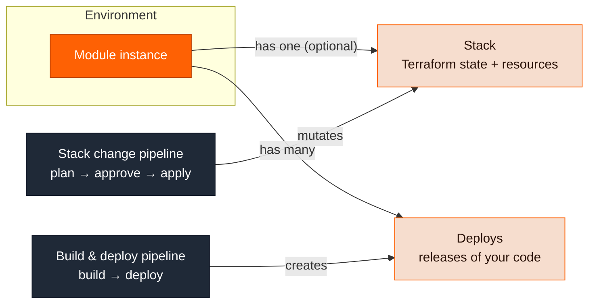

Ravion has four core nouns. Everything else in these docs builds on them.

| Concept      | One-line definition                                                                                                                                |
| ------------ | -------------------------------------------------------------------------------------------------------------------------------------------------- |
| **Module**   | The thing you create and manage: a VPC, a database, a web service. Modules are instances of versioned definitions from the catalog.                |
| **Stack**    | The Terraform or OpenTofu state behind a module — the record of the cloud resources it provisions.                                                 |
| **Deploy**   | A release of your application code to a module's runtime, such as a new image on an ECS service.                                                   |
| **Pipeline** | A workflow of steps — build, deploy, Terraform plan and apply, approvals — that does the work. Pipelines are how stacks change and deploys happen. |

A useful shorthand: **modules are the what, pipelines are the how.** Stacks and deploys are the two kinds of change a module goes through — infrastructure changes and code releases — and both are recorded on the module so you can inspect them later.

## How they relate

Modules live in environments, which live in projects. A module optionally has one stack and many deploys. Pipelines act on modules: stack pipelines mutate the stack, and deploy steps create deploys.



The key structural idea: **infrastructure changes and code releases are separate tracks.**

- Changing a module's _configuration_ (its inputs, like CPU size or an environment variable) triggers a **stack change pipeline run** that plans and applies Terraform. No code is rebuilt or redeployed.
- Shipping new _code_ triggers a **build and deploy pipeline** that produces an artifact and creates a deploy. No Terraform runs.

This is different from platforms that couple the two, where any config change forces a full redeploy.

## Modules

A module instance is the unit you create, configure, and monitor. Each instance is created from a specific version of a **module definition** — the Ravion [standard library](/module-definitions/standard-library) (`rvn-*` types) or your own custom definitions — from your organization's **catalog**.

The definition determines which **capabilities** the instance has: a stack, build config, a deploy manager, logs, metrics, and links. A VPC module has only a stack. An ECS web server module has all of them.

Module instances are organized in a hierarchy (see [Projects and environments](/concepts/projects-and-environments)):

```text
Organization → Project → Environment → Module instance
```

Modules in the same environment reference each other — a web service references its ECS cluster, which references its VPC — and consume each other's stack outputs.

See [Modules](/concepts/modules) and the [module catalog](/module-definitions/catalog).

## Stacks

If a module's definition includes Terraform, the instance gets exactly one **stack**. The stack holds the Terraform state, the list of provisioned resources, the history of plans and applies, and the module's outputs (which other modules reference).

You never run `terraform apply` against a stack directly. Stacks are mutated through two pipelines attached to every stack:

- A **change pipeline**: plan → approval → apply. Runs when you create the module or change its config.
- A **destroy pipeline**: plan (destroy) → approval → apply. Runs when you delete the module.

By default, stacks run through Ravion-managed system pipelines (`pipe_system_tf_change_pipeline` and `pipe_system_tf_destroy_pipeline`). These are read-only, but your platform team can replace them with custom pipelines at the organization, project, or environment level — for example to add policy checks. The approval gate is skipped when a run is started with `autoapprove` (the `--autoapprove` CLI flag).

See [Stack](/modules/stack).

## Deploys

A **deploy** (deployment) is a single release of application code to one module instance: pushing a new image to an ECS service, publishing a Lambda version, or promoting a static site directory. Each deploy records what was released, its status (`PENDING` → `IN_PROGRESS` → `SUCCESS`/`ERROR`), instance-level events, and enough of a snapshot to roll back to later.

Deploys are created three ways:

1. A `deploy` step in a Ravion pipeline, usually consuming a preceding build step's artifact.
2. The API or CLI (`ravion deploy create`) — this is how external CI systems like GitHub Actions trigger deploys.
3. The dashboard.

See [Deploy](/modules/deploy).

## Pipelines

A pipeline is a versioned workflow of steps. Ravion pipelines fill two roles:

1. **Your CI/CD** — optional pipelines you author, like **Build & Deploy**, that build code and create deploys. One pipeline serves many environments through [variants](/pipelines/variants).
2. **The stack engine** — the change and destroy pipelines every stack runs through. These are ordinary pipelines you can inspect and customize; Ravion just creates sensible defaults.

So when the docs say "stack change pipeline run", that is a normal pipeline run — visible under Pipelines, with steps, logs, and an approval — that happens to have been triggered by a config change instead of a git push.

See [Pipelines](/concepts/pipelines).

## The lifecycle, end to end

How the four concepts play out when you ship a new service:

<Steps>
  <Step title="Create the module">
    Add a module instance to your [project config file](/config-as-code/project-config-file) and
    apply it, or create it from the dashboard.
  </Step>
  <Step title="The stack change pipeline provisions infrastructure">
    Because the module has a stack, applying the config starts a stack change pipeline run:
    Terraform plan, approval, apply. The stack now tracks the provisioned resources and exposes
    outputs.
  </Step>
  <Step title="Push code and build">
    A git push (or manual trigger) starts your build and deploy pipeline. A build step produces an
    artifact, such as a digest-pinned image URI.
  </Step>
  <Step title="The deploy step creates a deploy">
    The pipeline's `deploy` step passes the artifact to the module's deploy manager, which creates a
    deploy and rolls it out — for ECS, with rolling, blue-green, canary, or linear strategies.
  </Step>
  <Step title="Monitor and roll back on the module">
    The module instance is the home for everything that follows: deploy history, instance-level
    deployment events, logs, and metrics. Roll back with `ravion deploy rollback` or a pipeline
    `rollback` step.
  </Step>
</Steps>

Later, changing the module's config (say, more CPU) only re-runs the stack track. Pushing new code only re-runs the deploy track.

## Where you see each concept

| Concept         | Docs                             | CLI                                                                                    |
| --------------- | -------------------------------- | -------------------------------------------------------------------------------------- |
| Module instance | [Modules](/concepts/modules)     | [`ravion module`](/cli/reference/module)                                               |
| Stack           | [Stack](/modules/stack)          | [`ravion stack`](/cli/reference/stack), [`ravion terraform`](/cli/reference/terraform) |
| Deploy          | [Deploy](/modules/deploy)        | [`ravion deploy`](/cli/reference/deploy)                                               |
| Pipeline        | [Pipelines](/concepts/pipelines) | [`ravion pipeline`](/cli/reference/pipeline)                                           |
