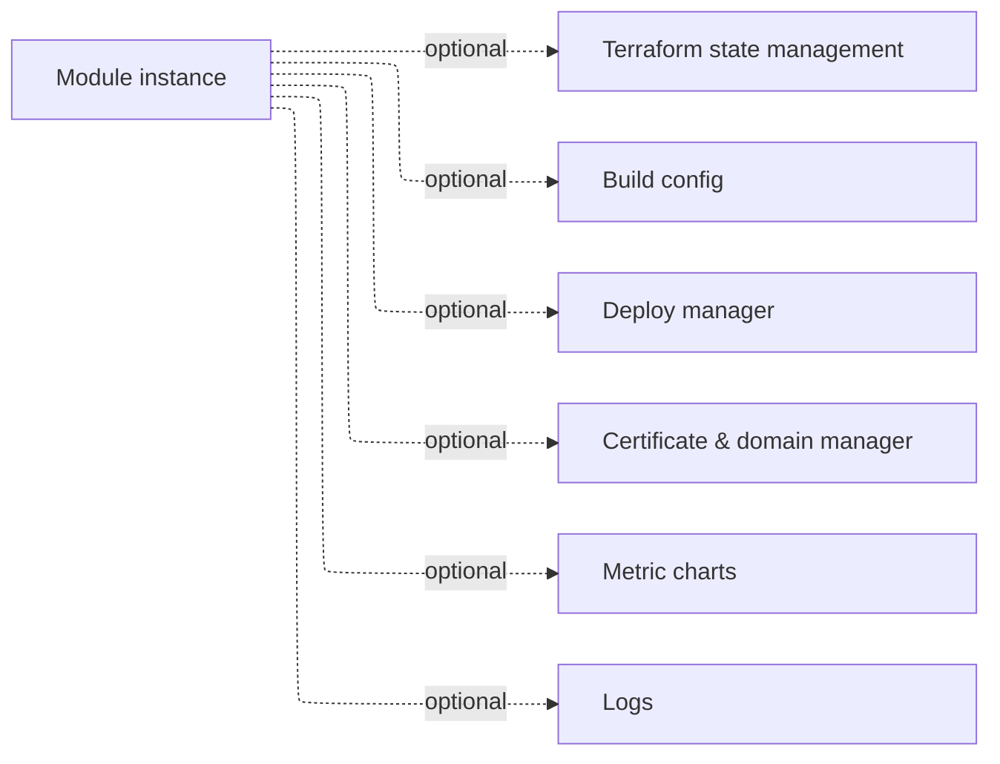
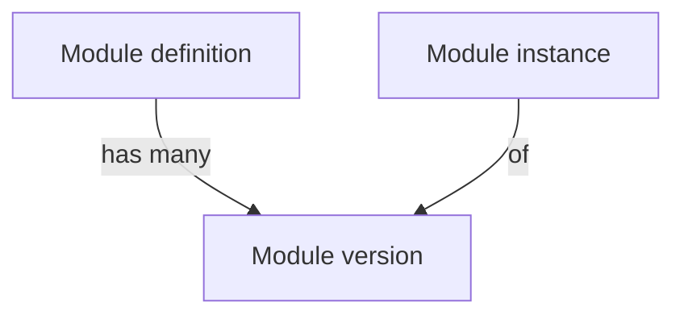

A **module** is a deployable unit of infrastructure. A module _definition_ (from the catalog) is instantiated as a module _instance_ inside an environment.

A module instance can optionally expose these facets:

## Module taxonomy

