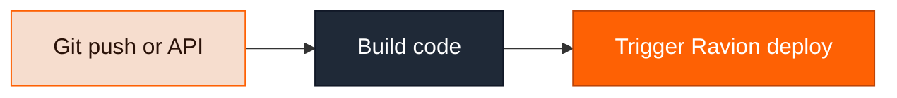
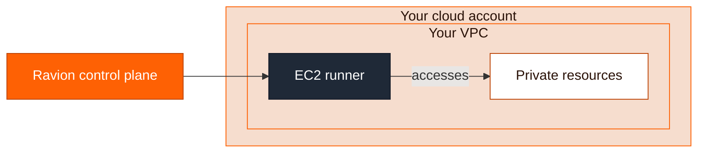

Ravion Pipelines are a full featured CI/CD system that runs in your cloud account.

They are _optional_ for you instead of using GitHub Actions or Circle CI.

Regardless, you will need to have a pipeline _somewhere_ to build your code, upload the artifacts to a store, and trigger a deployment of that in Ravion.

### You might want to use Ravion pipelines for the following reasons:

<Steps>
  <Step>
    You get **a single pane of glass and CLI/API surface area** to see all your builds, deploys, and infrastructure.
  </Step>

<Step>
  You get **enhanced security and control** because you no longer have to open up your database or
  image registries to GitHub Actions. Ravion pipelines execute entirely in your cloud account.
</Step>

  <Step>
    You can **define all your build configuration in the module** alongside your runtime config.
  </Step>
</Steps>

See [Pipelines](/pipelines/overview) for the detailed docs.
