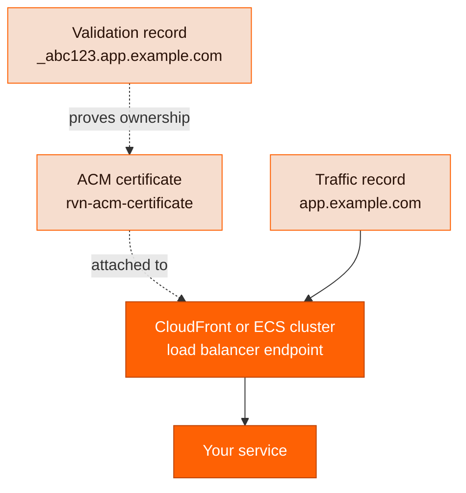

<Note>
  **Managed custom domains are coming soon.** Ravion will handle certificate creation and attachment
  for you. Until then, use the steps in this guide to manage custom domains yourself.
</Note>

Ravion doesn't manage domains for you automatically yet. Instead, you compose the same building blocks you use for everything else: an [ACM Certificate](/module-definitions/catalog/rvn-acm-certificate) module for TLS, the module that terminates traffic (an ECS cluster, whose load balancers serve your services, or CloudFront), and DNS records — managed either with a [Route 53](/module-definitions/catalog/rvn-route53) module or in an external DNS provider.

The process at a glance:

1. [Request the certificate](#step-1-request-the-certificate) with an `rvn-acm-certificate` module.
2. [Validate the certificate](#step-2-validate-the-certificate-with-dns) by creating the DNS **validation record** ACM asks for.
3. [Attach the issued certificate](#step-3-attach-the-certificate-to-your-module) to the module that terminates TLS.
4. [Point the traffic record at the endpoint](#step-4-point-dns-at-the-endpoint) and, optionally, [shift traffic gradually](#optional-shift-traffic-gradually).

## How custom domains fit together

Two different DNS records are involved, and they play separate roles:

- The **validation record** is a CNAME that proves to ACM that you control the domain. It never receives traffic — ACM just checks that it resolves, then issues the certificate. It stays in place for [automatic certificate renewal](#certificate-renewal).
- The **traffic record** is the record users actually hit: `app.example.com` pointing at your CloudFront distribution or ECS cluster load balancer.

Order matters. The certificate must be **validated** before AWS lets you attach it to an HTTPS or TLS listener, and the certificate must be **attached** before the endpoint can serve your domain. Only then do you change the traffic record — which means your current site keeps working untouched until the final cutover.



The certificate always lives in its own `rvn-acm-certificate` module instance. The module that terminates TLS references it as an input. Which module that is depends on how you expose the service:

| You're exposing                     | Certificate attaches to                                        | Input                                                   | Certificate region         |
| ----------------------------------- | -------------------------------------------------------------- | ------------------------------------------------------- | -------------------------- |
| ECS web service via the cluster ALB | [rvn-ecs-cluster](/module-definitions/catalog/rvn-ecs-cluster) | `public_alb_certificate` or `private_alb_certificate`   | Same region as the cluster |
| ECS services behind CloudFront      | [rvn-cloudfront](/module-definitions/catalog/rvn-cloudfront)   | `certificate` + `distribution_aliases`                  | `us-east-1`                |
| Static site                         | [rvn-aws-static](/module-definitions/catalog/rvn-aws-static)   | `distribution_acm_certificate` + `distribution_aliases` | `us-east-1`                |
| TCP/TLS service via NLB             | [rvn-ecs-nlb](/module-definitions/catalog/rvn-ecs-nlb)         | `tls_certificate`                                       | Same region as the cluster |

<Note>
  CloudFront is a global service, so any certificate used for CloudFront aliases must be requested
  in `us-east-1`, regardless of where the rest of your infrastructure runs. Certificates for an ECS
  cluster's load balancers must be in the same region as the cluster.
</Note>

## Step 1: Request the certificate

Add an `rvn-acm-certificate` module instance to your environment. The examples below use the [project config file](/config-as-code/project-config-file); you can do the same from the dashboard by adding a module instance of type `rvn-acm-certificate` and filling in the same fields.

ACM public certificates use DNS validation: ACM gives you one CNAME record per domain on the certificate, and issues the certificate once those records resolve. Decide **before the first apply** how those records get created, because `route53_validation_records_creation_enabled` is immutable after creation:

<Tabs>
<Tab title="Route 53-managed DNS">

If the domain already has a Route 53 public hosted zone in the same AWS account, let the certificate stack create the validation records and wait for issuance in a single apply:

```yaml ravion.yaml highlight={9-11}
- givenId: app-cert
  name: App certificate
  type: rvn-acm-certificate
  version: 0.3.1
  input:
    aws_account_id: my-aws-account
    aws_region: us-east-2 # us-east-1 for CloudFront or static sites
    domain_name: app.example.com
    route53_validation_records_creation_enabled: true
    route53_zone_id: Z1234567890ABC
    certificate_validation_wait_enabled: true
```

Route 53 automation is scoped to a single hosted zone. If your certificate covers domains whose validation records belong in multiple zones, use the external DNS configuration instead and create each record in its zone.

</Tab>
<Tab title="External DNS provider">

If DNS is managed in Cloudflare, your registrar, or any other provider, use the defaults — no Route 53 automation, no wait:

```yaml ravion.yaml
- givenId: app-cert
  name: App certificate
  type: rvn-acm-certificate
  version: 0.3.1
  input:
    aws_account_id: my-aws-account
    aws_region: us-east-2 # us-east-1 for CloudFront or static sites
    domain_name: app.example.com
```

In this mode the module is non-blocking: the apply requests the certificate and finishes while it's still **Pending validation**, and outputs the validation records for you to create in [Step 2](#step-2-validate-the-certificate-with-dns).

</Tab>
</Tabs>

Keep these rules in mind when filling in the certificate fields:

- **`domain_name`** is the primary fully qualified domain name, such as `app.example.com`, or a wildcard like `*.example.com`. It's immutable after creation — to change it, create a new certificate module.
- **`aws_region`** must match where the certificate is consumed: the ECS cluster's region, or `us-east-1` for CloudFront.

Apply the change to run the stack pipeline:

```bash
ravion project config apply <project-id> --file ravion.yaml --autoapprove
```

`--autoapprove` applies the Terraform plan without a manual approval gate. Drop the flag if you want to review the plan before it applies.

## Step 2: Validate the certificate with DNS

**If you enabled Route 53 automation in Step 1, you're done** — the apply created the validation CNAMEs in the hosted zone and blocked until ACM issued the certificate, which usually takes a few minutes.

If DNS is managed externally, create the validation records yourself:

<Steps>
  <Step title="Copy the validation records from the stack outputs">
    Open the certificate module in the dashboard and check the stack outputs, or fetch them from
    the CLI:

    ```bash
    ravion stack get <stack-id> --json
    ```

    Each domain on the certificate gets one validation record with a name like
    `_abc123.app.example.com`, type `CNAME`, and a value like `_xyz789.acm-validations.aws.`.

  </Step>
  <Step title="Create the CNAME records in your DNS provider">
    For each validation record, create a `CNAME` record with the exact name and value from the
    outputs. Two provider-specific gotchas:

    - **Cloudflare**: set the record to **DNS only** (gray cloud). Proxied records break ACM validation.
    - Some providers automatically append your zone name — if the output name is `_abc123.app.example.com` and your zone is `example.com`, you may need to enter only `_abc123.app`.

  </Step>
  <Step title="Verify the record resolves">
    ```bash
    dig +short CNAME _abc123.app.example.com
    ```

    The answer should be the `acm-validations.aws.` value. ACM then typically issues the
    certificate within a few minutes, though DNS propagation can take longer.

  </Step>
  <Step title="Optionally enable the issuance wait">
    Once validation records exist, you can set `certificate_validation_wait_enabled: true` and
    apply again. This field is mutable, and enabling it makes future applies fail fast if the
    certificate ever can't validate. You can also just confirm the certificate shows **Issued** in
    the [ACM console](https://console.aws.amazon.com/acm/home).
  </Step>
</Steps>

## Step 3: Attach the certificate to your module

Reference the certificate module from the module that terminates TLS, using `moduleGivenIdRef` in the config file or the module picker in the dashboard.

<Tabs>
<Tab title="ECS web service (ALB)">

The certificate attaches to the **cluster**, because the ECS cluster owns the ALB and its HTTPS listener. Each web service then claims its hostnames with **Domain host rules** (`host_header_values`), which become ALB listener rules:

```yaml ravion.yaml highlight={9-10,20-21}
- givenId: ecs-cluster
  name: ECS Cluster
  type: rvn-ecs-cluster
  version: 0.2.2
  input:
    network:
      moduleGivenIdRef: vpc
    public_alb_enabled: true
    public_alb_certificate:
      moduleGivenIdRef: app-cert # Must be in the same region as the cluster
    # ...

- givenId: web-app
  name: Web app
  type: rvn-ecs-web
  version: 0.7.5
  input:
    cluster:
      moduleGivenIdRef: ecs-cluster
    host_header_values:
      - app.example.com
    # ...
```

If one ALB serves several domains, use a wildcard certificate that covers them — for example, `*.example.com` covers both `api.example.com` and `auth.example.com` — and give each service its own `host_header_values`. Use `private_alb_certificate` instead for services behind the private ALB.

</Tab>
<Tab title="CloudFront (ECS origin)">

For ECS services fronted by CloudFront, the distribution gets the domain aliases and a `us-east-1` certificate. The ALB keeps its own regional certificate for the origin leg, since the default origin protocol policy is HTTPS-only:

```yaml ravion.yaml highlight={9-12}
- givenId: cdn
  name: CDN
  type: rvn-cloudfront
  version: 0.1.1
  input:
    origin_source: ecs_cluster
    ecs_cluster:
      moduleGivenIdRef: ecs-cluster
    distribution_aliases:
      - app.example.com
    certificate:
      moduleGivenIdRef: app-cert-us-east-1 # Must be issued in us-east-1
```

CloudFront forwards the viewer's `Host` header to the ALB, so keep `distribution_aliases` in sync with the ECS services' `host_header_values` — every alias must match a host rule (or the services must route by path). See [Domain aliases and host routing](/module-definitions/catalog/rvn-cloudfront#domain-aliases-and-host-routing) for details.

</Tab>
<Tab title="Static site">

Static hosting exposes one CloudFront distribution. Set the aliases and a `us-east-1` certificate:

```yaml ravion.yaml highlight={6-9}
- givenId: marketing-site
  name: Marketing site
  type: rvn-aws-static
  version: 0.1.5
  input:
    distribution_aliases:
      - www.example.com
    distribution_acm_certificate:
      moduleGivenIdRef: app-cert-us-east-1 # Must be issued in us-east-1
    # ...
```

Leave `distribution_aliases` empty to keep serving from the default `cloudfront.net` domain.

</Tab>
<Tab title="NLB (TLS)">

For TCP/TLS services behind a Network Load Balancer, set the listener protocol to `TLS` and reference the certificate:

```yaml ravion.yaml highlight={8-11}
- givenId: tcp-service
  name: TCP service
  type: rvn-ecs-nlb
  version: 0.1.5
  input:
    cluster:
      moduleGivenIdRef: ecs-cluster
    listener_protocol: TLS
    tls_certificate:
      moduleGivenIdRef: app-cert # Must be in the same region as the NLB
    tls_target_protocol: TCP # TCP terminates TLS at the NLB; TLS re-encrypts to the task
    # ...
```

</Tab>
</Tabs>

Apply the config change with `ravion project config apply <project-id> --file ravion.yaml --autoapprove`. If the certificate is still **Pending validation**, AWS rejects attaching it to an HTTPS or TLS listener — finish [Step 2](#step-2-validate-the-certificate-with-dns) first.

## Step 4: Point DNS at the endpoint

Nothing reaches the new endpoint until DNS says so. That makes DNS your traffic switch — and your rollback lever.

<Steps>
  <Step title="Find the endpoint hostname">
    Get the target hostname from the terminating module's stack outputs in the dashboard, or with
    `ravion stack get <stack-id> --json`:

    - **ALB / NLB**: the load balancer DNS name, like `my-alb-123456.us-east-2.elb.amazonaws.com`
    - **CloudFront / static site**: the distribution domain, like `d1234abcd.cloudfront.net`

  </Step>
  <Step title="Test before changing DNS">
    Verify the endpoint serves your domain correctly without touching DNS:

    ```bash
    # ALB/CloudFront: resolve the endpoint IP, then force the connection
    dig +short d1234abcd.cloudfront.net
    curl -sv https://app.example.com/ --resolve app.example.com:443:<endpoint-ip>
    ```

    You should get a valid TLS handshake for `app.example.com` and the expected response. A
    certificate error here means the wrong certificate is attached; an HTTP 404/421 usually means
    the host rules or aliases don't match the domain.

  </Step>
  <Step title="Optionally lower the TTL on the existing record">
    If the domain currently points somewhere else, lower the record's TTL to 60 seconds and wait
    for the old TTL to expire before cutting over. This shortens the window where clients keep
    hitting the old target, and makes rollback near-instant.
  </Step>
  <Step title="Create or update the DNS record">
    <Tabs>
    <Tab title="Route 53 module">

    Use an [rvn-route53](/module-definitions/catalog/rvn-route53) module instance and an alias
    record. Alias records are the standard way to point at AWS targets and work at the zone apex:

    ```yaml ravion.yaml highlight={12-13}
    - givenId: dns
      name: DNS
      type: rvn-route53
      version: 0.2.0
      input:
        zone_creation_enabled: false
        zone_id: Z1234567890ABC
        records:
          - type: A
            name: app.example.com
            target_type: alias
            alias_name: d1234abcd.cloudfront.net
            alias_zone_id: Z2FDTNDATAQYW2 # CloudFront's fixed hosted zone ID
            alias_evaluate_target_health: false
    ```

    For an ALB or NLB target, use the load balancer's DNS name as `alias_name` and its canonical
    hosted zone ID as `alias_zone_id` (both are in the load balancer's details in the AWS console).

    </Tab>
    <Tab title="External DNS provider">

    Create a `CNAME` record from your domain to the endpoint hostname. CNAMEs can't live at the
    zone apex (`example.com`), so for apex domains use your provider's ALIAS/ANAME/flattening
    feature or move DNS to Route 53.

    </Tab>
    </Tabs>
  </Step>
  <Step title="Verify the cutover">
    ```bash
    dig +short app.example.com
    curl -s -o /dev/null -w "%{http_code}" https://app.example.com/
    ```

    Once responses come from the new endpoint and error rates look normal in the module's
    [metrics](/modules/metrics) and [logs](/modules/logs), raise the TTL back to a normal value
    such as 300 seconds.

  </Step>
</Steps>

## Optional: shift traffic gradually

For higher-stakes cutovers, use Route 53 **weighted routing** to move a fraction of traffic at a time instead of flipping everything at once. Create two records with the same name and type, each with a `set_identifier` and a weight:

```yaml ravion.yaml highlight={7-9,16-18}
records:
  - type: A
    name: app.example.com
    target_type: alias
    alias_name: old-alb-123.us-east-2.elb.amazonaws.com
    alias_zone_id: Z3AADJGX6KTTL2 # Old target's hosted zone ID
    routing_policy: weighted
    set_identifier: old
    weighted_routing_policy_weight: 90

  - type: A
    name: app.example.com
    target_type: alias
    alias_name: d1234abcd.cloudfront.net
    alias_zone_id: Z2FDTNDATAQYW2
    routing_policy: weighted
    set_identifier: new
    weighted_routing_policy_weight: 10
```

Then ramp in stages:

1. Start at 90/10 and watch error rates and latency on the new target.
2. Move through 50/50 to 0/100, applying the config change at each stage.
3. Once the old target has drained, remove the old record and the `routing_policy` fields to return to a simple record.

Traffic splits are approximate — DNS caching means clients move over gradually as their cached answers expire. Rollback at any stage is just shifting the weights back.

<Note>
  Weighted DNS shifts traffic *between endpoints*, such as an old load balancer and a new one. For
  shifting traffic between application versions on the same endpoint, use the built-in blue/green,
  canary, and linear [deploy strategies](/modules/deploy) instead.
</Note>

## Certificate renewal

ACM [renews DNS-validated certificates automatically](https://docs.aws.amazon.com/acm/latest/userguide/dns-renewal-validation.html). Starting 45 days before expiration, ACM re-validates and renews the certificate when both conditions hold:

- The certificate is **in use** by an AWS service — attached to your ALB, NLB, or CloudFront distribution.
- All validation CNAME records are still present and resolvable via public DNS.

Renewal happens in place: the certificate keeps the **same ARN**, so your module references keep working with no config change, Terraform plan, or redeploy.

Because of this, never delete the validation CNAME records after issuance — removing them (or detaching the certificate from every AWS resource) silently breaks the next renewal. If ACM can't re-validate, it notifies you through AWS Health and EventBridge events starting 30 days before expiration.

## Troubleshooting

| Symptom                                                             | Likely cause                                                                  | Fix                                                                                                                  |
| ------------------------------------------------------------------- | ----------------------------------------------------------------------------- | -------------------------------------------------------------------------------------------------------------------- |
| Certificate stuck in **Pending validation**                         | Validation CNAMEs missing, mistyped, or proxied                               | Recheck record name/value against the stack outputs; in Cloudflare, set the record to DNS only                       |
| Validation never completes despite correct CNAMEs                   | A `CAA` record on the domain blocks Amazon                                    | Add `example.com. CAA 0 issue "amazon.com"` or remove the restrictive CAA record                                     |
| Apply fails attaching the certificate to a listener or distribution | Certificate not yet issued, or wrong region                                   | Finish DNS validation first; recreate the certificate in the ECS cluster's region or `us-east-1` for CloudFront      |
| HTTP 421 or wrong service responds                                  | Domain doesn't match any host rule or alias                                   | Add the domain to the service's `host_header_values` and, for CloudFront, to `distribution_aliases`                  |
| CloudFront returns the app but TLS-to-origin fails (502)            | ALB has no HTTPS listener or its certificate doesn't cover the forwarded host | Attach a regional certificate covering the domain to the cluster ALB, or set the origin protocol policy to HTTP only |
| New DNS record works for some clients only                          | Old record still cached                                                       | Wait out the previous TTL; verify with `dig` against `8.8.8.8` and your local resolver                               |
| Can't create a CNAME for the apex domain                            | CNAMEs aren't allowed at the zone apex                                        | Use a Route 53 alias record or your provider's ALIAS/ANAME feature                                                   |

## Related pages

<CardGroup cols={2}>
  <Card title="ACM Certificate" icon="lock" href="/module-definitions/catalog/rvn-acm-certificate">
    Full input reference for `rvn-acm-certificate`.
  </Card>
  <Card title="Route 53 DNS" icon="globe" href="/module-definitions/catalog/rvn-route53">
    Hosted zones, records, and routing policies with `rvn-route53`.
  </Card>
  <Card title="CloudFront CDN" icon="bolt" href="/module-definitions/catalog/rvn-cloudfront">
    Aliases, certificates, and origin routing for `rvn-cloudfront`.
  </Card>
  <Card title="ECS Cluster" icon="server" href="/module-definitions/catalog/rvn-ecs-cluster">
    ALB certificates and listeners on `rvn-ecs-cluster`.
  </Card>
  <Card title="Static Hosting" icon="file" href="/module-definitions/catalog/rvn-aws-static">
    Custom domains for static sites with `rvn-aws-static`.
  </Card>
  <Card title="Deploy strategies" icon="rocket" href="/modules/deploy">
    Blue/green, canary, and linear traffic shifting between app versions.
  </Card>
</CardGroup>
