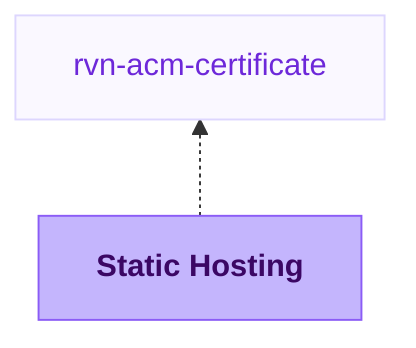

{/* Generated by scripts/sync-module-catalog.mjs from the Ravion module catalog. Do not edit by hand. */}

**Type:** `rvn-aws-static` · **Latest version:** `0.1.5`

## Dependencies and consumers

_Every dependency input can be specified manually to reference existing external infrastructure rather than a Ravion module._

## Readme

Static file hosting for S3-backed sites and assets delivered through CloudFront.

### Overview

The Static Hosting module creates an AWS S3 hosting bucket, a CloudFront distribution, CloudFront KeyValueStore version routing, and the supporting edge functions needed to serve versioned static files.

Use it for single-page apps, generated documentation, static marketing sites, downloadable assets, or any static file tree that should be served through CloudFront. Ravion can build files from a Git repository with Nixpacks or a Dockerfile, or you can disable builds and promote an existing S3 directory at deploy time.

Every deployment is versioned. The deploy step promotes an S3 directory by updating the CloudFront KeyValueStore active pointer. CloudFront rewrites viewer requests to the active version prefix before it reads from S3.

Terraform source: [flightcontrolhq/modules/hosting/static_site](https://github.com/flightcontrolhq/modules/tree/rvn-aws-static@0.1.5/hosting/static_site)

### Use cases

| Scenario | Static Hosting helps by... |
| --- | --- |
| Hosting a SPA | Rewriting client-side routes to the active version's root object |
| Hosting docs or generated static files | Serving filesystem-style paths from S3 through CloudFront |
| Building from source | Running Nixpacks or Dockerfile builds and uploading build output to S3 |
| Deploying prebuilt files | Skipping builds and promoting an existing S3 directory |
| Using custom domains | Attaching CloudFront aliases and an ACM certificate |
| Tuning cache behavior | Managing HTML and asset Cache-Control headers separately |
| Auditing access | Enabling CloudFront access logs with automatic log bucket creation |

### Hosting and routing

Choose an AWS account and Region for the S3 bucket. CloudFront and the CloudFront KeyValueStore are global services and use us-east-1 behind the scenes; the Region field controls the hosting bucket region.

Name slug is required and is used for the bucket name and resource prefixes. Because S3 bucket names are globally unique, use a stable slug that is unlikely to collide with another AWS account.

Routing mode controls how viewer paths resolve inside the active version prefix.

| Routing mode | Use it for | Behavior |
| --- | --- | --- |
| Single page app | React, Vue, TanStack Router, and other client-side routers | Non-asset routes resolve to the active version's root object |
| Filesystem | Astro, Hugo, MkDocs, and static file trees | Clean paths resolve to matching files or index files |

Default root object defaults to index.html. Default version prefix defaults to main and is used before any deploy has promoted a different active version.

### Build options

| Build type | When to use it |
| --- | --- |
| Nixpacks | Let Ravion detect the static app stack and run the build |
| Dockerfile | Build static files with a Dockerfile in the selected repository |
| Disabled | Build or upload files outside Ravion, then promote an existing S3 directory |

For Nixpacks and Dockerfile builds, select a Git repository, optional source base path, and output directory. The output directory is the folder Ravion uploads to the hosting bucket after the build.

Nixpacks settings let you override install command, build command, config path, build path, Nixpacks version, Nix packages, APT packages, and Nix libraries.

Docker settings let you choose the Dockerfile path and Docker build context. Inject environment variables in Dockerfile passes build environment variables as Docker build arguments.

Build environment variables are available to static builds and can be plain values or references loaded from Parameter Store or Secrets Manager.

### CloudFront distribution

The module exposes one CloudFront distribution. Domain aliases are optional. Leave them empty to use the default cloudfront.net domain. If you set domain aliases, select an ACM certificate module created in us-east-1.

The first domain alias is used as the CloudFront distribution comment. The distribution is always created enabled.

Price class controls the CloudFront edge location footprint. PriceClass_All uses all edge locations. PriceClass_200 and PriceClass_100 can reduce edge coverage for cost-sensitive workloads.

Geo restriction can be none, whitelist, or blacklist. When whitelist or blacklist is selected, provide ISO country codes in Geo restriction country codes.

### Cache and headers

Manage Cache-Control headers is enabled by default. When enabled, the module attaches a CloudFront Function that sets different browser cache headers for HTML-like responses and static assets.

| Setting | Default | Purpose |
| --- | --- | --- |
| HTML Cache-Control | Terraform module default: s-maxage=5, stale-while-revalidate=31536000 | Keeps HTML and route responses fresh while allowing edge revalidation |
| Asset Cache-Control | Terraform module default: public, max-age=31536000, immutable | Lets versioned assets be cached by browsers for a long time |
| HTML cache path overrides | Terraform module defaults for service workers, manifests, favicon, robots, and sitemap | Treats stable root files as HTML-like responses instead of immutable assets |
| No-cache path patterns | [] | Bypasses CloudFront caching for selected path patterns |
| Cache policy ID | AWS managed CachingOptimized by default | Controls CloudFront cache behavior |
| Origin request policy ID | AWS managed CORS-S3Origin by default | Controls what CloudFront forwards to S3 |

Use Response headers policy ID to attach an existing CloudFront response headers policy. Use Managed response headers policy when this module should create one for security headers, CORS, custom headers, or removed headers. Avoid putting Cache-Control into a response headers policy unless you intentionally want to override the cache-control function.

### Access logging

CloudFront access logging is off by default. When enabled, the module automatically creates a logging bucket and stores CloudFront access logs there.

Logging retention days defaults to 90 and controls how long logs are retained in the automatically created logging bucket.

### Deploy behavior

The deploy step uses an S3 directory value. For Ravion builds, use the directory produced by the build/upload flow. For Disabled builds, enter the existing S3 prefix that already contains the files to promote.

CloudFront invalidation paths defaults to /*. This invalidates the full distribution after promotion. Because deployments are versioned, invalidations are often conservative rather than strictly required, but the default favors correctness for users who are changing stable paths.

Successful deploys to retain defaults to 20. Older deploy directories are pruned from the hosting bucket based on this setting.

### Builder config

Builder config is only used for Nixpacks and Dockerfile builds.

| Field | Default | Purpose |
| --- | --- | --- |
| Builder instance type | EC2 | Choose EC2 or EC2 Spot for build runners |
| Builder instance size | c7a.4xlarge | Select the EC2 size used for builds |
| Builder execution environment | unset | Override where build runners execute |
| Builder AMI | unset | Use a custom build runner AMI |

EC2 Spot can reduce build cost, but builds may wait longer or be interrupted. Start with the default builder size, then adjust based on build resource usage.

### Configuration

| Section | Field | Required | Default | Notes |
| --- | --- | --- | --- | --- |
| AWS account & region | AWS account | Yes | none | Account where S3 and supporting resources are created |
| AWS account & region | Region | Yes | us-east-1 | Region for the S3 bucket |
| Static hosting | Name slug | Yes | Generated from project, environment, and module IDs | Must be globally unique as an S3 bucket name |
| Static hosting | Routing mode | Yes | Single page app | Choose SPA or filesystem URL handling |
| Static hosting | Default root object | No | index.html | Root object for distribution root requests |
| Static hosting | Default version prefix | Yes | main | Initial and fallback version prefix |
| Build config | Build type | Yes | Nixpacks | Nixpacks, Dockerfile, or Disabled |
| Build config | Git repository | Required for Nixpacks and Dockerfile | none | Source repository for builds |
| Build config | Source base path | No | . | Path from repository root to source code |
| Build config | Output directory | Required for Nixpacks and Dockerfile | dist | Directory uploaded to S3 after build |
| CloudFront settings | ACM certificate | Required when using aliases | none | Certificate module must be in us-east-1 |
| CloudFront settings | Domain aliases | No | [] | Custom CloudFront aliases |
| CloudFront settings | Price class | No | PriceClass_All | Edge location coverage |
| CloudFront settings | Geo restriction | No | none | Optional country allow or deny list |
| Cache and headers | Manage Cache-Control headers | No | true | Attaches the cache-control function |
| Access logging | CloudFront access logging | No | false | Creates a logging bucket when enabled |
| Access logging | Logging retention days | No | 90 | Visible when logging is enabled |
| Deploy config | CloudFront invalidation paths | No | /* | Paths invalidated after promotion |
| Deploy config | Successful deploys to retain | No | 20 | Old S3 deploy prefixes to retain |
| Terraform settings | Terraform execution environment | No | unset | Override Terraform runner environment |
| Terraform settings | OpenTofu version | No | first available version | OpenTofu version for infrastructure changes |
| Terraform settings | Ravion Terraform workspace name | No | Generated from project, environment, and module IDs | Override state backend workspace name |
| Terraform settings | Advanced Terraform variables | No | \{\} | Escape hatch for uncommon Terraform inputs |
| Terraform settings | Tags | No | none | Additional tags; Ravion also adds standard ownership tags |

### Design decisions

The module exposes one CloudFront distribution instead of the full Terraform distributions map. This keeps the Ravion form focused on the common case while still supporting custom domains and certificate configuration.

The CloudFront distribution is always enabled. If traffic should not yet use the distribution, leave DNS records pointed elsewhere until ready.

Access logging automatically creates its logging bucket when enabled. This avoids requiring users to pre-create and wire a separate logging bucket for the common audit trail use case.

CloudFront and KVS behavior is intentionally versioned. Promotions change which S3 prefix is active rather than overwriting files in place.

### Learn more

- [Amazon CloudFront documentation](https://docs.aws.amazon.com/cloudfront/)
- [CloudFront KeyValueStore](https://docs.aws.amazon.com/AmazonCloudFront/latest/DeveloperGuide/kvs-with-functions.html)
- [Serving static websites with S3 and CloudFront](https://docs.aws.amazon.com/AmazonS3/latest/userguide/WebsiteHosting.html)
- [CloudFront response headers policies](https://docs.aws.amazon.com/AmazonCloudFront/latest/DeveloperGuide/understanding-response-headers-policies.html)

## Inputs reference

All inputs for `rvn-aws-static` version `0.1.5`. Use the `name` shown for each field as the input key in module config.

### AWS account & region

<ResponseField name="aws_account_id" type="string" required>
  **AWS account.**

  - Immutable after creation
</ResponseField>

<ResponseField name="aws_region" type="string" required>
  **Region.** Region for the S3 bucket. CloudFront and KVS always use us-east-1.

  - Default: `us-east-1`
  - Immutable after creation
</ResponseField>

### Static hosting

<ResponseField name="name" type="string" required>
  **Name slug.** Name for the bucket and other resources' prefix. Must be globally unique.

  - Default: `<<project.given_id>>-<<environment.given_id>>-<<module.given_id>>`
  - Immutable after creation
  - Pattern: `^[a-z0-9][a-z0-9.-]*[a-z0-9]$` — Use a valid S3 bucket name: lowercase letters, numbers, hyphens, and periods; start and end with a letter or number.
</ResponseField>

<ResponseField name="routing" type="string" required>
  **Routing mode.** Use single page app for client-side routers, or Filesystem for static file trees where paths map to index files.

  - Default: `spa`
  - Allowed values: `spa` (Single page app), `filesystem` (Filesystem)
</ResponseField>

<ResponseField name="default_root_object" type="string">
  **Default root object.** Object name resolved when a viewer requests the distribution root.

  - Default: `index.html`
</ResponseField>

<ResponseField name="default_version" type="string" required>
  **Default version prefix.** Fallback version prefix and initial active KVS value.

  - Default: `main`
</ResponseField>

### Build config

<ResponseField name="build_type" type="string" required>
  **Build type.**

  - Default: `nixpacks`
  - Allowed values: `nixpacks` (Nixpacks), `dockerfile` (Dockerfile), `none` (Disabled)
</ResponseField>

<ResponseField name="source_repo" type="gitrepo" required>
  **Git repository.**

  - Shown when: `{"build_type":["nixpacks","dockerfile"]}`
</ResponseField>

<ResponseField name="source_base_path" type="string">
  **Source base path.** Path from repo root to your source code.

  - Default: `.`
  - Shown when: `{"build_type":["nixpacks","dockerfile"]}`
</ResponseField>

<ResponseField name="output_directory" type="string" required>
  **Output directory.** Directory produced by the build and uploaded to S3.

  - Default: `dist`
  - Shown when: `{"build_type":["nixpacks","dockerfile"]}`
</ResponseField>

### Docker

<ResponseField name="dockerfile" type="string">
  **Dockerfile path.** Path to the Dockerfile to use for the build, relative to the repository root or configured source base path.

  - Shown when: `{"build_type":"dockerfile"}`
</ResponseField>

<ResponseField name="dockerfile_context" type="string">
  **Docker build context path.** Directory to use as the Docker build context, relative to the repository root or configured source base path.

  - Shown when: `{"build_type":"dockerfile"}`
</ResponseField>

### Nixpacks

<ResponseField name="nixpacks_install_cmd" type="string">
  **Install command.**

  - Shown when: `{"build_type":"nixpacks"}`
</ResponseField>

<ResponseField name="nixpacks_build_cmd" type="string">
  **Build command.**

  - Shown when: `{"build_type":"nixpacks"}`
</ResponseField>

<ResponseField name="nixpacks_config_file_path" type="string">
  **Nixpacks config file path.** Path to a custom Nixpacks config file, relative to the repository root or configured source base path.

  - Shown when: `{"build_type":"nixpacks"}`
</ResponseField>

<ResponseField name="nixpacks_build_path" type="string">
  **Nixpacks build path.** Application path for Nixpacks to build, relative to the repository root or configured source base path.

  - Shown when: `{"build_type":"nixpacks"}`
</ResponseField>

<ResponseField name="nixpacks_version" type="string">
  **Nixpacks version.** Optional Nixpacks version to use for the build. Leave blank to use the default version.

  - Shown when: `{"build_type":"nixpacks"}`
</ResponseField>

<ResponseField name="nixpacks_nix_pkgs" type="string_array">
  **Nix packages.** Additional Nix packages to install during the Nixpacks build.

  - Shown when: `{"build_type":"nixpacks"}`
</ResponseField>

<ResponseField name="nixpacks_apt_pkgs" type="string_array">
  **APT packages.** Additional APT packages to install during the Nixpacks build.

  - Shown when: `{"build_type":"nixpacks"}`
</ResponseField>

<ResponseField name="nixpacks_nix_libs" type="string_array">
  **Nix libraries.** Additional Nix libraries to make available during the Nixpacks build.

  - Shown when: `{"build_type":"nixpacks"}`
</ResponseField>

<ResponseField name="build_environment_variables" type="object">
  **Build environment variables.** Environment variables available during builds. Values can be plain strings or references loaded from Parameter Store or Secrets Manager.

  - Shown when: `{"build_type":["nixpacks","dockerfile"]}`
</ResponseField>

<ResponseField name="dockerfile_inject_env_variables" type="boolean">
  **Inject environment variables in Dockerfile.** Pass build environment variables into Dockerfile builds as build arguments.

  - Default: `false`
  - Shown when: `{"build_type":"dockerfile"}`
</ResponseField>

### CloudFront settings

<ResponseField name="distribution_acm_certificate" type="$ref:rvn-acm-certificate">
  **ACM certificate.** Required if using domain aliases. The certificate module must be in us-east-1.
</ResponseField>

<ResponseField name="distribution_aliases" type="string_array">
  **Domain aliases.** Custom domain names like app.example.com. Leave empty to use the default cloudfront.net domain.

  - Default: `[]`
</ResponseField>

<ResponseField name="price_class" type="string">
  **Price class.** You can reduce edge locations for some cost savings if it becomes an issue.

  - Default: `PriceClass_All`
  - Allowed values: `PriceClass_All` (All edge locations), `PriceClass_200` (Most edge locations), `PriceClass_100` (US, Canada, Europe)
</ResponseField>

<ResponseField name="geo_restriction_type" type="string">
  **Geo restriction.**

  - Default: `none`
  - Allowed values: `none` (None), `whitelist` (Whitelist), `blacklist` (Blacklist)
</ResponseField>

<ResponseField name="geo_restriction_locations" type="string_array">
  **Geo restriction country codes.**

  - Default: `[]`
  - Shown when: `{"geo_restriction_type":["whitelist","blacklist"]}`
</ResponseField>

### Cache and headers

<ResponseField name="cache_control_enabled" type="boolean">
  **Manage Cache-Control headers.** Attach a CloudFront Function that sets Cache-Control headers for HTML and asset responses.

  - Default: `true`
</ResponseField>

<ResponseField name="html_cache_control" type="string">
  **HTML Cache-Control.** Cache-Control header for HTML responses, routes without file extensions, dotted paths, and configured HTML path overrides. Defaults to s-maxage=5, stale-while-revalidate=31536000.

  - Shown when: `{"cache_control_enabled":true}`
</ResponseField>

<ResponseField name="assets_cache_control" type="string">
  **Asset Cache-Control.** Cache-Control header for versioned static assets such as JavaScript, CSS, images, and fonts. Defaults to public, max-age=31536000, immutable

  - Shown when: `{"cache_control_enabled":true}`
</ResponseField>

<ResponseField name="html_path_overrides" type="string_array">
  **HTML cache path overrides.** Exact viewer paths that should receive the HTML Cache-Control header even when they have a file extension.

  - Shown when: `{"cache_control_enabled":true}`
</ResponseField>

<ResponseField name="response_headers_policy_id" type="string">
  **Response headers policy ID.** Optional externally managed CloudFront response headers policy ID for security headers, CORS, or custom headers.
</ResponseField>

<ResponseField name="response_headers_policy" type="object">
  **Managed response headers policy.** Optional module-managed CloudFront response headers policy for security headers, CORS, custom headers, and removed headers.
</ResponseField>

<ResponseField name="cache_policy_id" type="string">
  **Cache policy ID.** CloudFront cache policy ID for the default behavior. Defaults to AWS managed CachingOptimized.
</ResponseField>

<ResponseField name="origin_request_policy_id" type="string">
  **Origin request policy ID.** CloudFront origin request policy ID. Defaults to AWS managed CORS-S3Origin.
</ResponseField>

<ResponseField name="no_cache_paths" type="string_array">
  **No-cache path patterns.** Path patterns that should bypass CloudFront caching. Versioned deploys usually do not need this.

  - Default: `[]`
</ResponseField>

### Access logging

<ResponseField name="logging_enabled" type="boolean">
  **CloudFront access logging.** Enable CloudFront access logging. When enabled, the module automatically creates a logging bucket.

  - Default: `false`
</ResponseField>

<ResponseField name="logging_retention_days" type="number">
  **Logging retention days.** Days to retain CloudFront access logs in the automatically created logging bucket.

  - Default: `90`
  - Min: `1`
  - Shown when: `{"logging_enabled":true}`
</ResponseField>

### Builder config

<ResponseField name="build_infrastructure_type" type="string" required>
  **Builder instance type.** Use EC2 for quick start or EC2 spot for cheaper, but potentially delayed builds.

  - Default: `ec2`
  - Allowed values: `ec2` (EC2), `ec2-spot` (EC2 spot)
  - Shown when: `{"build_type":["nixpacks","dockerfile"]}`
</ResponseField>

<ResponseField name="build_instance_size" type="string" required>
  **Builder instance size.** EC2 instance type for builds. Start with the default value, then increase or decrease it based on the resource usage report at the end of builds.

  - Default: `c7a.4xlarge`
  - Shown when: `{"build_type":["nixpacks","dockerfile"]}`
</ResponseField>

<ResponseField name="build_execution_environment_id" type="string">
  **Builder execution environment.** Optional execution environment ID or given ID for builds. Defaults to the module Terraform execution environment.

  - Shown when: `{"build_type":["nixpacks","dockerfile"]}`
</ResponseField>

<ResponseField name="build_ami" type="string">
  **Builder AMI.** Optional AMI ID for build runners. Leave empty to use the default runner image.

  - Shown when: `{"build_type":["nixpacks","dockerfile"]}`
</ResponseField>

### Deploy config

<ResponseField name="cloudfront_invalidation_paths" type="string_array">
  **CloudFront invalidation paths.** CloudFront paths to invalidate after promotion. Defaults to invalidating the full distribution.

  - Default: `["/*"]`
</ResponseField>

<ResponseField name="keep_latest_successful_deploy_count" type="number">
  **Successful deploys to retain.** Old deploys are automatically removed from the s3 bucket based on this config.

  - Default: `20`
  - Min: `0`
</ResponseField>

### Terraform settings

<ResponseField name="opentofu_version" type="string">
  **OpenTofu version override.** Override the environment's default version for this module
</ResponseField>

<ResponseField name="ravion_state_backend_workspace" type="string">
  **Ravion Terraform workspace name.** Override Terraform state backend workspace name. Defaults to project + environment + module given ids.

  - Immutable after creation
</ResponseField>

<ResponseField name="advanced_terraform_variables" type="object">
  **Advanced Terraform variables.** Optional raw Terraform variable overrides for advanced module inputs or one-off overrides. Values here override the generated variables above.

  - Default: `{}`
</ResponseField>

<ResponseField name="execution_environment_id" type="string">
  **Terraform execution environment.** Override the execution environment for Terraform runners. Must use the same AWS account as selected above.
</ResponseField>

<ResponseField name="tags" type="keyvalue">
  **Tags.** A map of tags to assign to all resources. Default tags are `Owner`, `ProjectGivenId`, `EnvironmentGivenId`, `ModuleGivenId`, `ModuleId`
</ResponseField>
