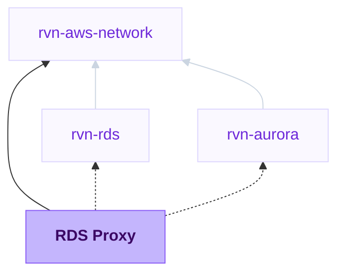

{/* Generated by scripts/sync-module-catalog.mjs from the Ravion module catalog. Do not edit by hand. */}

**Type:** `rvn-rds-proxy` · **Latest version:** `0.1.0`

## Dependencies and consumers

_Every dependency input can be specified manually to reference existing external infrastructure rather than a Ravion module._

## Readme

Creates and manages an Amazon RDS Proxy that provides connection pooling in front of an RDS instance or Aurora cluster.

### Overview

Use this module to place a managed connection pool in front of an existing database. The proxy holds a pool of database connections open and multiplexes application connections onto them, which protects the database from connection storms and makes failovers faster for clients.

The RDS and Aurora modules can create a proxy directly with their RDS Proxy toggle. Use this standalone module when the target database is not managed by Ravion, or when you want to manage the proxy lifecycle separately from the database.

### Target database

Target type selects whether the proxy registers an RDS instance or an Aurora cluster, and shows the matching database module selector.

Selecting an RDS or Aurora module fills the database identifier, managed master user secret, and port from that module's stack outputs. For a database managed outside Ravion, leave the module unselected and enter the identifier, and any auth secret ARNs, directly.

When a Ravion module supplies the target, add this proxy's security group ID to that module's allowed security groups. The proxy connects to the database through the database security group, and the database module owns those ingress rules.

Applications do not use the proxy until you point their connection string at the proxy endpoint output.

### Use cases

| Scenario | Benefit |
| --- | --- |
| Serverless or many-worker applications | Reuse pooled connections instead of opening one per worker. |
| Existing database | Add pooling in front of a database created outside Ravion. |
| Faster failover | Clients stay connected to the proxy while the database fails over. |
| IAM authentication | Require IAM auth for clients without changing database credentials. |

### Networking

Select a VPC network first. Ravion maps the network's AWS account, region, VPC ID, and private subnet IDs into this module. The proxy must be in the same VPC as the target database, and the database's security group must allow ingress from the proxy security group.

Allowed security groups and CIDR blocks control which sources can connect to the proxy.

### Authentication

The proxy reads database credentials from the Secrets Manager secrets listed in auth secret ARNs. Leave that field blank when a selected database module manages its master password in Secrets Manager; the proxy then uses that module's master user secret. Add auth secret ARNs explicitly for databases identified by identifier, for databases whose password is managed outside Secrets Manager, or to authenticate as a different database user.

The module creates an IAM role that can read only the resolved auth secrets; provide KMS key ARNs when the secrets use customer-managed keys. TLS is required by default, and IAM authentication for clients is optional.

### Configuration

| Field | Required | Default | Notes |
| --- | --- | --- | --- |
| VPC network | Yes | None | Supplies AWS account, region, VPC ID, and private subnet IDs. |
| Name slug | Yes | Project and environment given IDs + proxy | Proxy name and prefix for related resources. |
| Engine family | Yes | PostgreSQL | PostgreSQL, MySQL / MariaDB, or SQL Server. Must match the target database engine. |
| Target type | Yes | RDS instance | Register an RDS instance or an Aurora cluster as the proxy target. |
| RDS database / Aurora cluster | No | None | Fills the database identifier, master user secret, and port from the selected module. |
| DB instance / cluster identifier | Yes | None | Identifier of the target database. |
| Auth secret ARNs | No | Blank | Secrets Manager secrets with database credentials. Required when the target does not provide a managed master user secret. |
| Require TLS | No | true | Requires TLS for client connections. |
| IAM authentication | No | false | Requires IAM auth for client connections. |
| Security group creation | No | true | Creates ingress rules from allowed security groups and CIDRs. |
| Max connections (%) | No | 100 | Pool size as a percentage of the database max_connections. |
| Idle client timeout | No | 1800 | Seconds before idle client connections are closed. |
| Tags | No | Blank | Merged with Ravion standard tags. |

### Advanced configuration

Connection pool settings control borrow timeouts, idle connection limits, session pinning filters, and an initialization query. Debug logging sends detailed connection information to CloudWatch Logs. Use advanced Terraform variables for one-off overrides not represented directly in the UI.

Terraform settings let you override the OpenTofu version, Terraform execution environment inherited from the VPC network, and Ravion state backend workspace name.

### Design decisions

The proxy is placed in private subnets by default through the VPC network reference. TLS enforcement and Secrets Manager based authentication default on. The created IAM role follows least privilege and can read only the listed auth secrets.

### Learn more

- [Amazon RDS Proxy documentation](https://docs.aws.amazon.com/AmazonRDS/latest/UserGuide/rds-proxy.html)
- [RDS Proxy managing connections](https://docs.aws.amazon.com/AmazonRDS/latest/UserGuide/rds-proxy-managing.html)
- [Terraform source](https://github.com/ravionhq/modules/tree/rvn-rds-proxy@0.1.0/database/rds-proxy)

## Inputs reference

All inputs for `rvn-rds-proxy` version `0.1.0`. Use the `name` shown for each field as the input key in module config.

<ResponseField name="network" type="$ref:rvn-aws-network" required>
  **VPC network.**

  - Immutable after creation
</ResponseField>

### Proxy

<ResponseField name="name" type="string" required>
  **Name slug.** Name prefix for all proxy resources.

  - Default: `<<project.given_id>>-<<environment.given_id>>-proxy`
  - Immutable after creation
  - Pattern: `^[a-z0-9]([a-z0-9-]{0,38}[a-z0-9])?$` — 1-40 lowercase letters, numbers, and hyphens. Start and end with a letter or number.
</ResponseField>

<ResponseField name="engine_family" type="string" required>
  **Engine family.** Must match the engine of the target database.

  - Default: `POSTGRESQL`
  - Allowed values: `POSTGRESQL` (PostgreSQL), `MYSQL` (MySQL / MariaDB), `SQLSERVER` (SQL Server)
  - Immutable after creation
</ResponseField>

### Target database

<ResponseField name="target_type" type="string" required>
  **Target type.** Register an RDS instance or an Aurora cluster as the proxy target.

  - Default: `db_instance`
  - Allowed values: `db_instance` (RDS instance), `db_cluster` (Aurora cluster)
</ResponseField>

<ResponseField name="rds_database" type="$ref:rvn-rds">
  **RDS database.** RDS database module to register as the proxy target. Add this proxy's security group to that module's allowed security groups so the database accepts proxy connections.

  - Shown when: `{"target_type":"db_instance"}`
</ResponseField>

<ResponseField name="aurora_database" type="$ref:rvn-aurora">
  **Aurora cluster.** Aurora cluster module to register as the proxy target. Add this proxy's security group to that module's allowed security groups so the cluster accepts proxy connections.

  - Shown when: `{"target_type":"db_cluster"}`
</ResponseField>

### Authentication

<ResponseField name="auth_secret_arns" type="string_array">
  **Auth secret ARNs.** Secrets Manager secrets containing database credentials the proxy uses to connect to the target database. Leave blank to use the managed master user secret of the selected database module.
</ResponseField>

<ResponseField name="secret_kms_key_arns" type="string_array">
  **Auth secret KMS key ARNs.** KMS keys used to encrypt the auth secrets when using customer-managed keys.
</ResponseField>

<ResponseField name="iam_auth_enabled" type="boolean">
  **IAM authentication.** Require IAM authentication for client connections to the proxy.

  - Default: `false`
</ResponseField>

<ResponseField name="tls_requirement_enabled" type="boolean">
  **Require TLS.** Require TLS for client connections to the proxy.

  - Default: `true`
</ResponseField>

<ResponseField name="iam_role_creation_enabled" type="boolean">
  **IAM role creation.** Create the IAM role the proxy uses to read credentials from Secrets Manager. Disable this only when you want to provide an existing role.

  - Default: `true`
  - Immutable after creation
</ResponseField>

<ResponseField name="iam_role_arn" type="string">
  **Existing IAM role ARN.**

  - Shown when: `{"iam_role_creation_enabled":false}`
</ResponseField>

### Network access

<ResponseField name="port" type="number">
  **Port.** Leave blank to use the port of the selected database module, or the engine family default port: 5432 for PostgreSQL, 3306 for MySQL, or 1433 for SQL Server.

  - Min: `1`
  - Max: `65535`
</ResponseField>

<ResponseField name="security_group_creation_enabled" type="boolean">
  **Security group creation.**

  - Default: `true`
  - Immutable after creation
</ResponseField>

<ResponseField name="security_group_id" type="string">
  **Existing security group ID.**

  - Shown when: `{"security_group_creation_enabled":false}`
</ResponseField>

<ResponseField name="allowed_security_group_ids" type="string_array">
  **Allowed security groups.**

  - Shown when: `{"security_group_creation_enabled":true}`
</ResponseField>

<ResponseField name="allowed_cidr_blocks" type="string_array">
  **Allowed CIDR blocks.**

  - Shown when: `{"security_group_creation_enabled":true}`
</ResponseField>

### Connection pool

<ResponseField name="idle_client_timeout" type="number">
  **Idle client timeout (seconds).**

  - Default: `1800`
  - Min: `1`
  - Max: `28800`
</ResponseField>

<ResponseField name="connection_borrow_timeout" type="number">
  **Connection borrow timeout (seconds).**

  - Default: `120`
  - Min: `0`
</ResponseField>

<ResponseField name="max_connections_percent" type="number">
  **Max connections (%).** Maximum size of the connection pool as a percentage of the database max_connections setting.

  - Default: `100`
  - Min: `1`
  - Max: `100`
</ResponseField>

<ResponseField name="max_idle_connections_percent" type="number">
  **Max idle connections (%).** Maximum idle connections kept open, as a percentage of the database max_connections setting.

  - Default: `50`
  - Min: `0`
  - Max: `100`
</ResponseField>

<ResponseField name="session_pinning_filters" type="string_array">
  **Session pinning filters.**

  - Allowed values: `EXCLUDE_VARIABLE_SETS`
</ResponseField>

<ResponseField name="init_query" type="string">
  **Initialization query.** SQL statements the proxy runs when opening each new database connection.
</ResponseField>

<ResponseField name="debug_logging_enabled" type="boolean">
  **Debug logging.** Log detailed connection information, including SQL statements, to CloudWatch Logs.

  - Default: `false`
</ResponseField>

### Misc

<ResponseField name="tags" type="keyvalue">
  **Tags.** A map of tags to assign to all resources. Default tags are `Owner`, `ProjectGivenId`, `EnvironmentGivenId`, `ModuleGivenId`, `ModuleId`
</ResponseField>

### Terraform settings

<ResponseField name="opentofu_version" type="string">
  **OpenTofu version override.** Override the environment's default version for this module
</ResponseField>

<ResponseField name="ravion_state_backend_workspace" type="string">
  **Ravion Terraform workspace name.** Override Terraform state backend workspace name. Defaults to project + environment + module given ids.

  - Immutable after creation
</ResponseField>

<ResponseField name="advanced_terraform_variables" type="object">
  **Advanced Terraform variables.** Optional raw Terraform variable overrides for advanced module inputs or one-off overrides. Values here override the generated variables above.

  - Default: `{}`
</ResponseField>
