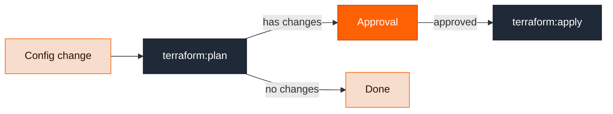

A **stack** is the infrastructure-as-code state behind a module instance. If a module's definition includes a `stack` block, every instance of that module gets exactly one stack. Modules without infrastructure — or whose definitions only configure build and deploy behavior — have no stack.

The stack tracks:

- **Resources** — every Terraform resource the module manages, with its type, address, and the change it went through in each run (create, update, delete, replace).
- **Change history** — every plan and apply, with resource-change counts and full output.
- **Outputs** — the stack's Terraform outputs. Other modules consume these through references like `<< ref.stack.output.vpc_id >>`, which is how a web service module finds its cluster and network.

## Stacks change through pipelines

You never run `terraform apply` against a stack by hand. Every stack has two pipelines attached:

| Pipeline    | Steps                                             | Runs when                                   |
| ----------- | ------------------------------------------------- | ------------------------------------------- |
| **Change**  | `terraform:plan` → `approval` → `terraform:apply` | The module is created or its config changes |
| **Destroy** | destroy plan → `approval` → `terraform:apply`     | The module is deleted                       |

A run of one of these is what the docs call a **stack change pipeline run**. It is an ordinary pipeline run — you inspect it under Pipelines with steps, logs, and Terraform results like any other run.

The flow within a change run:



- The plan and apply steps run on temporary EC2 instances in your cloud account, so your Terraform code and secrets never enter the Ravion control plane. The plan file is uploaded to S3 and the apply consumes exactly that plan.
- The approval step is skipped when the plan has no changes, or when the run was started with **autoapprove** (for example `--autoapprove` on `ravion project config apply` or `ravion stack trigger-pipeline`). Autoapprove applies to change runs only — destroy runs always require manual approval.
- Runs are locked per stack, so two runs can't apply to the same state concurrently.

### Default pipelines and customization

Ravion automatically creates default change and destroy pipelines the first time a stack needs them, in a project named **Terraform Pipelines**. They are regular pipelines: your platform team can edit them — to add policy checks, notifications, or different approval rules — or point stacks at entirely custom pipelines through the module definition's `stack.pipelines` config. See the [module definition schema](/module-definitions/definition-schema).

### Initial run when creating a module

When you create a stack-backed module instance you choose the initial stack run behavior:

- `NONE` (default) — create the instance without running Terraform yet.
- `PLAN` — start a change run that stops at the approval gate.
- `APPLY` — start a change run with autoapprove enabled.

With the CLI this is `ravion module create --initial-stack-run`.

## State storage

Ravion can act as your managed Terraform state backend: set `ravion_state_backend_workspace` in the module definition's stack config and Ravion stores versioned state for you, with locking. Alternatively, use your own remote backend such as S3 and DynamoDB. Local state backends are not supported.

## Inspecting stacks

```bash
# List stacks and view one
ravion stack list
ravion stack get <stack-id>

# Count current-state resources across stacks
ravion stack resource-count

# Trigger a change or destroy run manually
ravion stack trigger-pipeline <stack-id> --pipeline-type change
ravion stack trigger-pipeline <stack-id> --pipeline-type change --autoapprove

# Inspect Terraform runs and resources
ravion terraform execution-summary list --stack-id <stack-id>
ravion pipeline run get-plan <pipeline-run-id>
ravion pipeline run get-apply <pipeline-run-id>
```

See the [`ravion stack`](/cli/reference/stack) and [`ravion terraform`](/cli/reference/terraform) CLI references.
