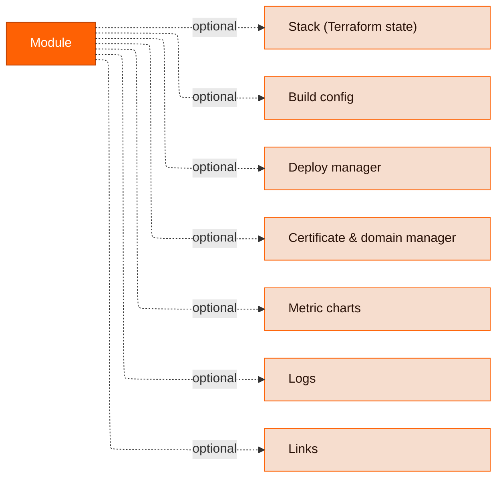
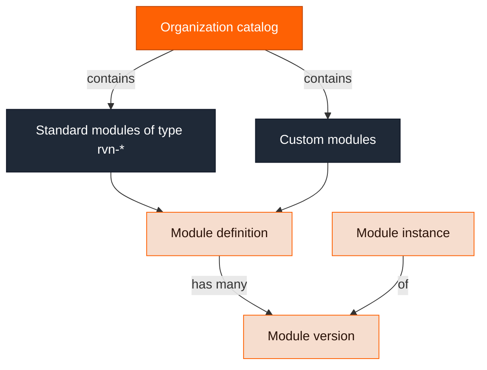

A module is the core primitive in Ravion for both tracking and managing your services and supporting infrastructure.

A module's definition determines which **capabilities** its instances have — a Terraform stack, build config, deploy manager, and so on:

For example, our **VPC Network** module has only a stack. But the **ECS Web Server** module has _all_ of the above capabilities.

For how modules relate to stacks, deploys, and pipelines, see [Core concepts](/concepts/core-concepts).

By default, you have access to the Ravion [standard library](/module-definitions/standard-library) of module definitions. You can see the available module definitions via the _Catalog_ page in the dashboard or via the `/module-definitions` endpoint.

You can also create your own module definitions.

## Module hierarchy

_Catalog_ is used to refer to the module definitions available to your organization. These include the Ravion [standard library](/module-definitions/standard-library) of modules with type `rvn-*` and any custom modules you've added.

Module definitions are versioned with semver, and each module instance is an instance of a specific version.

